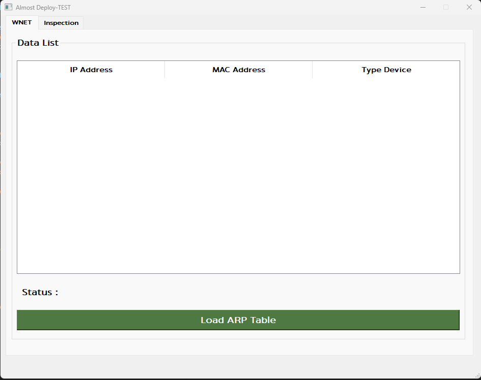

<H1> ARP Edge Inspection </H1>

<H3> Feature </H3>

- Edge Devices Scanner ( Rasberry Pi and Banana Pi)   
- Edge Devices Inspection (Device ID, Device Name, Wlan0 Config, Device Storage and Docker Component)

<H1> Overview </H1>

- This program has two tabs. The first tab is used for MAC Address Scanner, and the second is for Edge Devices Inspection.    

  Figure 1 : MAC Address Scanner   

